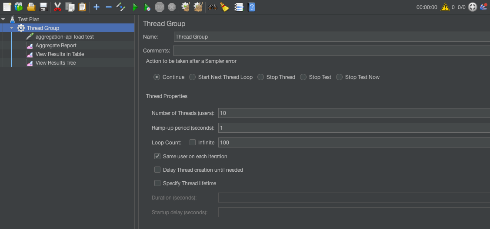
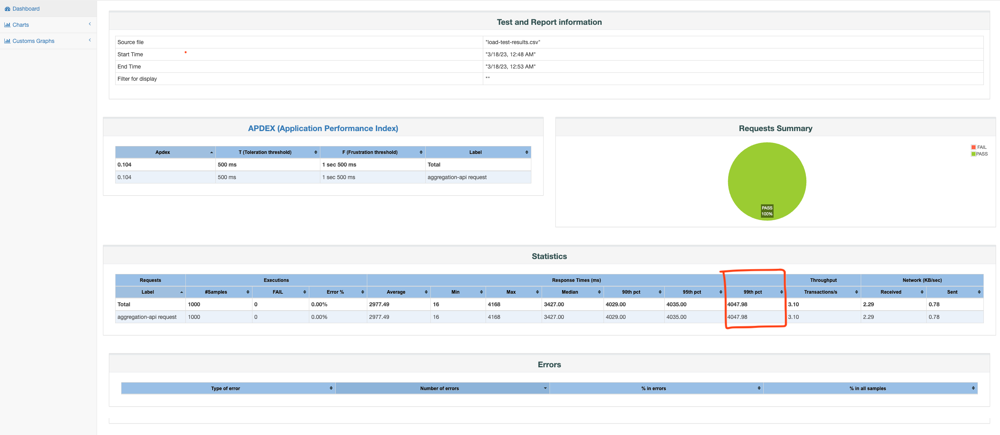

# Application

This application a [microservice API composer](https://microservices.io/patterns/data/api-composition.html).

Its job is to aggregate the results coming from 3 backend services (Shipments, Track, and Pricing) while providing an
SLA of 5 seconds for the 99th percentile. That means 99% of the request must take less than 5 seconds to respond - only
1% can take longer than 5 seconds.

The 3 backend services are not part of this application. They actually bundled together under the same [Docker
container](https://hub.docker.com/r/qwkz/backend-services/tags).

## APIs Contracts

Any of the 3 APIs (Shipments, Track, Pricing) can only receive 1 input per request and return 1 output per response:

Shipments API:

```
GET 
http://127.0.0.1:4000/shipment-products?orderNumber=109347263

200 OK
Content-Type: application/json

["BOX", "BOX", "PALLET"]
```

Track API:

```
GET 
http://127.0.0.1:4000/track-status?orderNumber=109347263

200 OK
Content-Type: application/json

"IN_TRANSIT"
```

Pricing API:

```
GET 
http://127.0.0.1:4000/pricing?countryCode=NL

200 OK
Content-Type: application/json

14.242090605778
```

But this API composer app must support multiple inputs and outputs in its Aggregation API:

```
GET 
http://127.0.0.1:8080/aggregation?shipmentsOrderNumbers=987654321,123456789&trackOrderNumbers=987654321,123456789&pricingCountryCodes=NL,CN`

200 OK
Content-Type: application/json

{
    "shipments": {
        "987654321": ["BOX", "BOX", "PALLET"]
    },
    "track": {
        "123456789": "COLLECTING"
    },
    "pricing": {
        "NL": 14.242090605778
        "CN": 20.503467806384
    }
}
```

# Design decisions

## Technology choices:

- **Spring Boot:** Simplifies web application development. Provides a quick setup and a robust ecosystem.

- **Spring WebFlux:** Offers high-performance and non-blocking I/O for handling a large number of concurrent
  connections. Integrates with Spring Boot and provides a simple programming model for reactive applications (based on
  Project Reactor).

- **Project Reactor:** Provides a set of operators and APIs for building reactive streams and processing data
  asynchronously. Provides Spring WebFlux with reactive capabilities.

- **Docker:** Provides a lightweight and isolated runtime environment. Makes the app and its dependent microservice
  portable and independent of the host environment.

- **Docker Compose:** Simplifies the management of both the Aggregation API and the Backend Services API depends on by
  starting them together and sure they can communicate.

- **JMeter**: Can simulate a large numbers of requests, and measure the 99th percentile.

### Why reactive?

Minimizing latency is important in a distributed system.

To minimize latency, an API composer should call other services in parallel whenever possible. That will minimize the
response time. But if there are dependencies between provider services, some may need to be called sequentially.
Efficiently running a mix of sequential and parallel service invocations can be complex.

That's where the reactive design comes into play. API composers should use a reactive design to best achieve
maintainability, performance, and scalability.

## API orchestration decisions


### Orchestrating the calls to each API - Shipments, Track, Pricing

#### Problem

Considering the contract described under the **APIs Contracts** section, we can only send one input at a time to any of
the backed services. But the Aggregation API must support a list for both the outputs and the inputs.

Let's take the Pricing API as an example to better illustrate this point. We will consider the request params for the
Shipments and Track services to be empty so no calls will be made to these services.

If we look at the contract, one aggregation request receives multiple inputs (countryCodes) to pass forward to the
Pricing API. It also returns multiple outputs (prices). To achieve that, we must actually send multiple request to the
Pricing API.

#### Solution

We can send all the single-input requests to the Pricing API asynchronously in parallel. Then we bundle together the
input (pricingCountryCode) and the output (price) into a DTO called `Pricing`. When all the requests have been addressed
by the Pricing API, we collect all the results into a map (countryCode --> price) and remove all the entries that have
an empty value from price.

Project Reactor helps us do that with its concise, functional-programming style API:

```
    public Mono<Map<String, Optional<Double>>> getPricing(List<String> pricingCountryCodes) {
        return Flux.fromIterable(pricingCountryCodes)
            .parallel()
            .runOn(Schedulers.parallel())
            .flatMap(pricingClient::getPricing)
            .sequential()
            .collectMap(Pricing::getCountryCode, Pricing::getPrice)
            .doOnNext(this::removeEmptyValues);
    }

    private boolean removeEmptyValues(Map<String, Optional<Double>> pricing) {
        return pricing.entrySet().removeIf(entry -> entry.getValue().isEmpty());
    }
```

This pattern minimizes the latency when building the list of outputs (prices) for each Pricing API call.

We follow the same pattern for the Shipments and Track APIs. 

That settles the calls to the individual backend APIs. But how do we aggregate the results of all these calls? Let's talk about that in the next section.

### Orchestrating the Aggregation services calls

#### Problem

Calling multiple APIs sequentially to then aggregate the responses can introduce a high level of latency.

#### Solution

Because there are no dependencies between the Shipments, Track, and Pricing APIs we can call them at the same. When all the 3 responses are available, we can build the aggregation result.

Project Reactor helps us do that in an elegant way. The `Mono.zip` operator subscribes eagerly to all the
publishers. When all the 3 responses are available we create the Aggregation response:

```
    public Mono<Aggregation> aggregate(Optional<List<String>> shipmentsOrderNumbers,
                                       Optional<List<String>> trackOrderNumbers,
                                       Optional<List<String>> pricingCountryCodes) {

        Mono<Map<String, Optional<List<Product>>>> shipments = shipmentsOrderNumbers
            .map(shipmentService::getShipment)
            .orElse(Mono.just(Map.of()));

        Mono<Map<String, Optional<Status>>> track = trackOrderNumbers
            .map(trackService::getTrack)
            .orElse(Mono.just(Map.of()));

        Mono<Map<String, Optional<Double>>> pricing = pricingCountryCodes
            .map(pricingService::getPricing)
            .orElse(Mono.just(Map.of()));

        return Mono.zip(shipments, track, pricing)
            .map(tuple -> aggregate(tuple.getT1(), tuple.getT2(), tuple.getT3()));
    }
    
    private Aggregation aggregate(Map<String, Optional<List<Product>>> shipments,
                                  Map<String, Optional<Status>> track,
                                  Map<String, Optional<Double>> pricing) {

        return Aggregation.builder()
            .shipments(shipments)
            .track(track)
            .pricing(pricing)
            .build();
    }
```

This pattern minimizes§ the latency when aggregating the maps that result from the implementation we discussed in the previous section.

## Starting the application

- Run the sh script `runApps.sh`.

This script:

- runs the Maven build (without tests)
- builds the container image of the Aggregation API
- starts both Aggregation API and the Backed Services API using docker compose

To stop the app hit `Ctrl + C` in the same terminal window.

## The JMeter load test

Configuration:



The test uses 1000 samples (10 threads/users x 100 loops). That's the equivalent of 10 users sending 100 requests each,
resulting in 1000 requests total.

### Running the JMeter load test

Precondition: The apps have already been started with `runApps.sh`.

- Run the sh script `runLoadTest.sh`.

This script runs the jmeter command that tests the app.

It will generate the following reports under the app dir in
the [jmeter-load-test/load-test-results](jmeter-load-test/load-test-results_1) folder:

- `load-test-results.csv` - the record of all the requests and their results
- `load-test-run.log` - JMeter logs
- `load-test-web-report` - folder containing the`index.html` file that displays the JMeter dashboard for the test

⚠️ The test will never fail because I found no way to assert percentile results in JMeter, but you can open the html
report and check the value for the 99th percentile, as shown in the next section.

### JMeter load test results - the 99th percentile

The goal was to get a duration lower than 5000 ms for the 99th percentile.
Such an SLA means 99% of the requests would take less than 5 seconds to respond.

This is a screenshot of the results I got when running the test locally:



#### Optimizations

I optimized for this result empirically by changing the timeout value for the requests to the Backend Services API. This
timeout value indirectly affects the SLA by giving up on the requests that don't respond in time. The value I settled
for is 2500 ms. The tradeoff here is that we may miss data that was on the way but couldn't reach our system before the
timeout threshold.

#### Limitations

⚠️ Please keep in mind that these results are relative to my local machine which is not similar at all to a real-life
production environment.

It's generally recommended to run performance tests on a dedicated machine or a cloud-based solution that resembles the
production environment as much as possible because performance depends on processing power, memory, and disk space to
handle the load. This approach eliminates the impact of the local machine limitations, protecting the accuracy of the
results.

### Integration load test - SLATest.java

There is also the `SLATest` integration test that runs 1000 requests in parallel using the ForkJoin common pool of
threads. It saves the durations in a sorted collection and compares the 99th percentile to the SLA of 5 seconds.

I actually created it before creating the JMeter test, but I recommend relying on the JMeter test results because that
approach is closer to a production environment scenario - considering the application a black box, feeding it inputs,
and measuring outputs.

Still, I decided to keep it as a smoke test that developers working on the app can run to check if their work impacts
the performance.

Please consider this test a bonus, but not the final indicator of the SLA.

⚠️ This test slows down the build time a lot.

## Future considerations

### Changes in tech stack - Caching?
